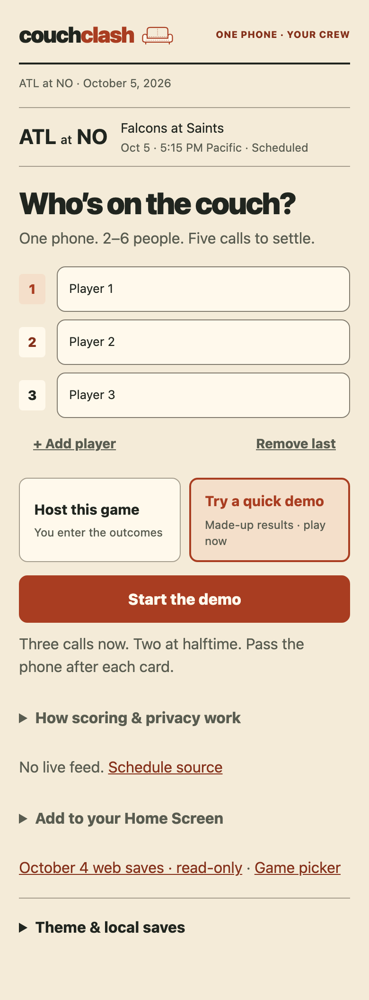
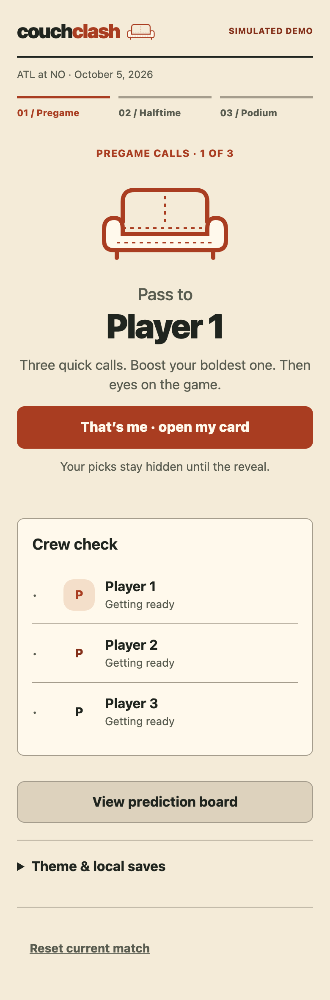
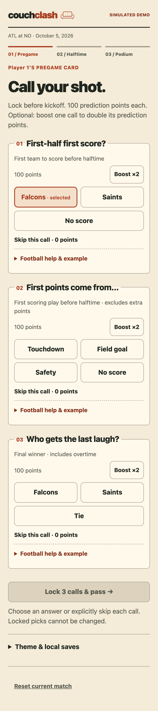
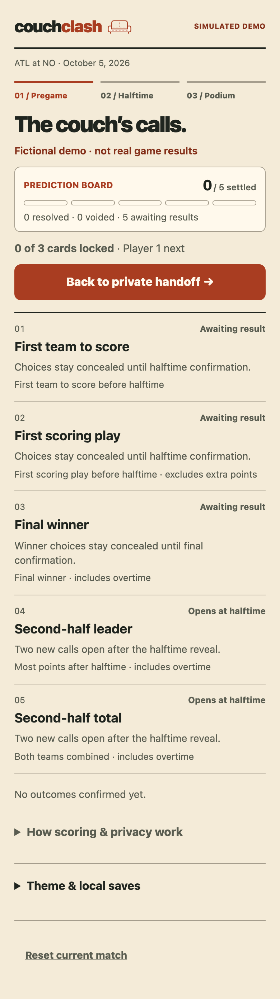

# Integrated scorecard iteration

A warm paper scorecard and original stitched couch replace the previous glow/card visual treatment. Setup brings names and start action into the first viewport; handoff keeps a deliberate identity gate; numbered slips place answers before optional football help. The board now reports the actual locked-card count and shows predictions sooner. The five immutable questions, scoring, OT scope, storage keys and round mutations are unchanged.

Screenshots are scripted synthetic data, captured at 390 CSS pixels / 2x. They were visually reviewed; no physical-device or human playtest is implied.

| Setup | Handoff |
|---|---|
|  |  |

| Pick slips | Board |
|---|---|
|  |  |

Checks: 320/390/1180 widths, first setup action and first board call position, all three themes' main/body/muted text contrast, explicit selected labels, private cards after reload, 200% board text, full mobile manual/demo rounds and save/history/offline regression. The enlarged-text check initially failed at the header/progress row; wrapping was fixed and passed. It does not prove every element in every screen meets all accessibility criteria.

The new cache version preserves old caches/stores. The fetch timeout now extends through reading the response body; a deliberately stalled-body test verifies cache fallback. Upgrade assertions now actually inspect old cache presence and both locked/draft rendered team labels instead of reporting a hardcoded old-cache flag. Earlier failed navigation attempts remain failed attempts, not passes.

Still manual: no connected live feed, shared-phone sync, player fantasy scoring, or authenticated participant ownership. The independent native build and App Store readiness gates are separate.

Independent visual review prompted two bounded fixes: selected fill is now #F4DFCA and input/select boundaries #817B6E in the default theme. Design assertions cover selected text and both boundary surfaces in all three themes. A subsequent code review identified status-zero navigation redirects; the worker now preserves opaque redirect responses, and the fixture exercises real 301 redirects plus slash/no-slash routes online and offline.

A fresh-context follow-up reproduced a first-use offline no-slash route failure that the prior cached-301 test missed. The fallback now redirects exact directory names to their canonical slash URL before serving relative assets. The stricter test visits these no-slash routes offline before any online redirect. A separate fresh-browser check reached the correct legacy heading. Runtime-only snapshots avoid unrelated document/image hydration in the fixture; earlier diagnostic timeouts are retained and not counted as passes.
