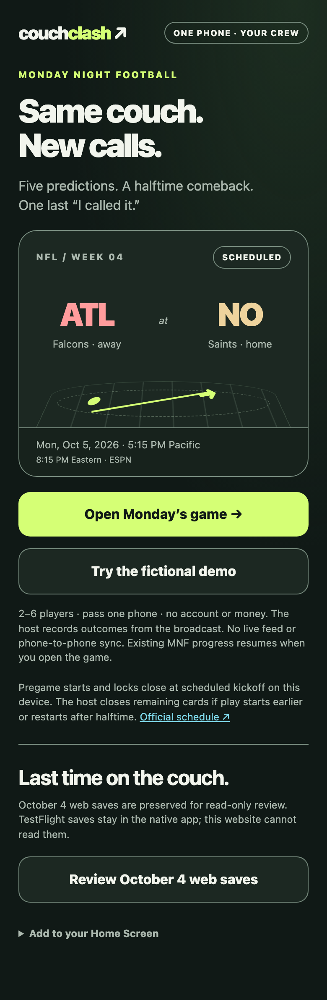
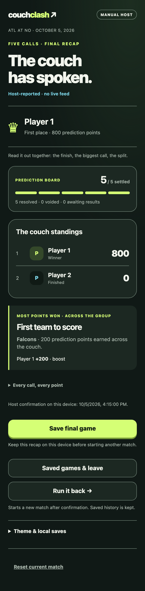

# MNF release validation

The candidate uses synthetic data only. See [checksums and results](../tests/mnf/results.json) and [test commands](../tests/mnf/README.md).

Passing checks: actual-code logic for manual/demo maximum 800, ties, skips, explicit voids versus pending, no-score consistency, cutoff before/at/after kickoff, manual close preserving locked cards, history/reset/erase, malformed/unsupported data and changed-definition refusal; v1/v2 legacy read-only rendering and byte equality. Headless mobile browser checks cover 390×844 and 320×740, keyboard help, control sizes, privacy across reload/reveal, full manual/demo rounds, quota failure, read-only recaps and offline routes. The production `/couch-clash/` prefix is tested.

The old public v4 service worker was loaded first, synthetic locked/draft saves were seeded, then the server switched to the candidate. New worker identity and complete cache were explicitly verified; saved bytes/labels and offline home/MNF/legacy routes passed. Earlier tests exposed a navigation stall and an inadequate registration-only readiness check. The candidate now bounds network waits at three seconds before using cache; the test confirms the actual controlling worker by version message. Failed attempts are not counted as passes. The corrected transition passed repeatedly, including at the deployment prefix.

Screenshots below use scripted test inputs, not actual Falcons/Saints results. Representative home, picks and recap pixels were reviewed. Physical-device launch, Safari, VoiceOver and real group engagement remain unverified.

Native Build 3 source hashes were rechecked and remain unchanged. Original public app.js/style.css and icons remain unchanged. Historical web saves are read-only in the new viewer; native saves cannot be read by the website. Tests never opened a personal browser profile or touched real saved games.
